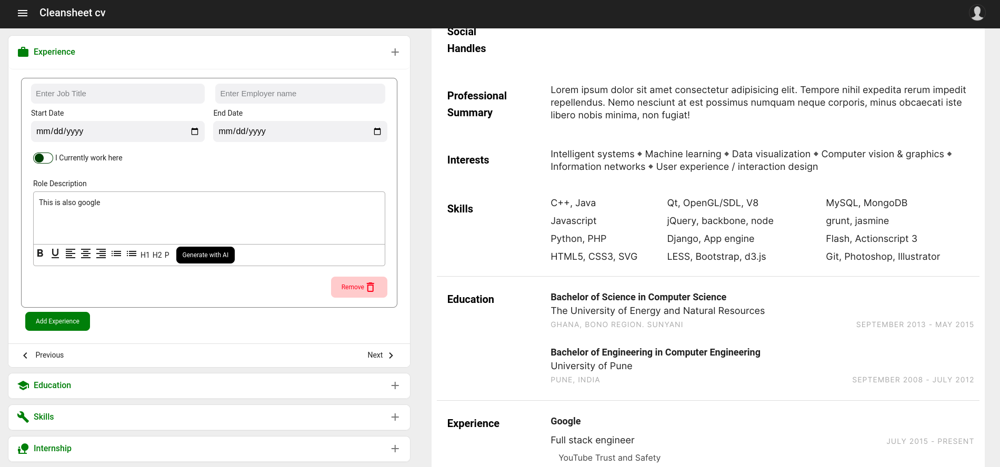

 # AI CV/Resume Builder

<!-- <p align="center"></p> -->


Professional CV Builder: Open-Source, Secure, and ATS-Optimized
This project is a unique, privacy-focused resume builder designed to help you create professional CVs with ease. It offers complete security, customization options, and portability, ensuring your personal data remains protected. As an open-source project, it is entirely free to use and will remain so forever. Users can generate downloadable PDF versions of their resumes in various pre-designed templates.


## Features

- **Privacy-Centric**: Your data stays with you—no external storage or third-party access.
- **Fully Customizable**: Tailor your CV to any profession or industry with flexible design and format options.
- **ATS-Optimized**: Generate CVs that comply with Applicant Tracking Systems (ATS), ensuring your resume passes automated screening algorithms.
- **Open-Source & Free Forever**: Contribute, customize, and use the tool with no costs involved, now or in the future.
- **User-friendly Interface**: Simple, clean, and intuitive UI for building resumes.
- **Live Preview**: Real-time preview of the resume as users add or modify content.
- **Customizable Templates**: Multiple resume templates to choose from.
- **PDF Export**: Download the resume as a PDF file.
- **Sections Management**: Add, remove, or reorder sections like education, work experience, skills, and more.
- **Input Validation**: Ensure that users fill out all required fields correctly.
- **Responsive Design**: Works seamlessly on desktops, tablets, and mobile devices.
- **Data Persistence**: Option to save progress in the browser (local storage) or via user accounts (optional).
 
Try it out today and create a professional CV suited to your career goals!

 
### Prerequisites
Before running the project, ensure you have the following installed:

- [Node.js](https://nodejs.org/en/download/)
- [npm](https://www.npmjs.com/get-npm)
- [AngularCli](https://angular.dev/tools/cli)

### Getting Started

1. **Clone the repository:**

   ```bash
   git clone https://github.com/acquahsamuel/cleansheet-resume-builder.git

   cd cleansheet-resume-builder


   Run npm install command 
   Open package.json  
   Run ng serve command
